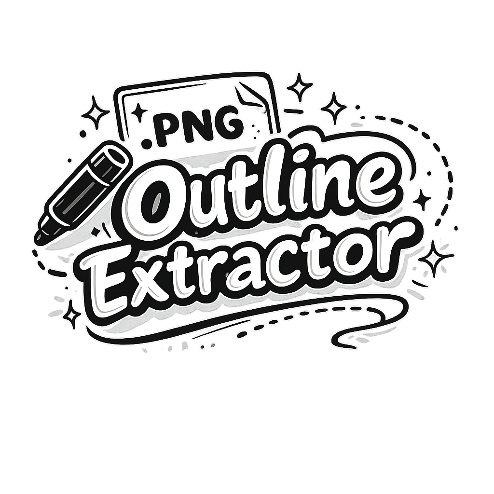
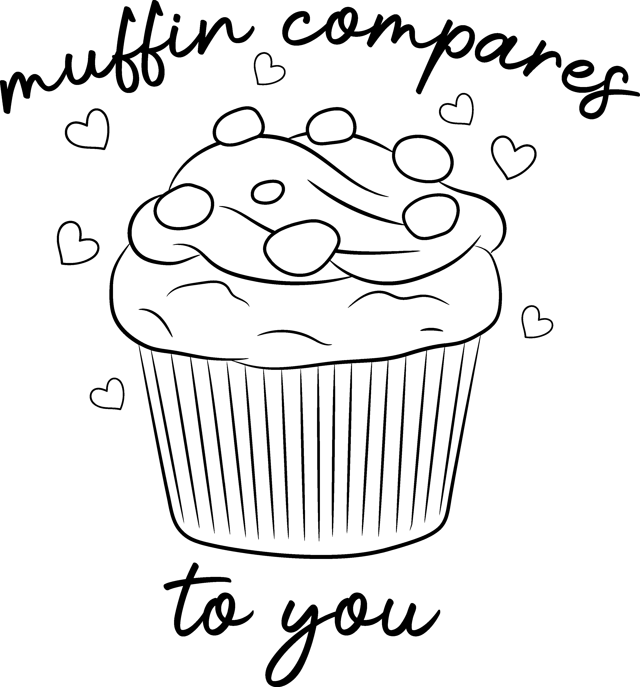

<p align="center">
  
</p>

<p align="center">
  <a href="#"></a>
  <a href="#"></a>
</p>

<h1 align="center">PNG Outline Extractor</h1>

<p align="center">
  <strong>PNG Outline Extractor</strong> is a small Dockerized CLI tool that batch-processes PNG images and exports outline-only versions by removing color fills and keeping only the black/dark line work.
</p>
<p align="center">
  Perfect for turning artwork into <strong>line art</strong>, <strong>coloring-book style images</strong>, or clean <strong>stroke-only overlays</strong>.
</p>

---

## ✅ What it does

For every `.png` file found in an input folder (recursively), it:

- keeps only the black/dark outline pixels
- removes all other colors
- outputs a **transparent PNG**
- preserves folder structure
- keeps the original filename, but appends: `_Black`

Example:

```code
input/cupcake.png -> output/cupcake_Black.png
```

---

## 📦 Requirements

You only need:

- **Docker**

No local Python install required.

---

## 🐳 Build the Docker image

From the repo root:

```bash
docker build -t png-outline-extractor .
```

## ▶️ How to Run it

Basic usage:

This will read PNGs from `./input` and write to `./output`:

```bash
docker run --rm \
  -v "$(pwd)/input:/in" \
  -v "$(pwd)/output:/out" \
  png-outline-extractor --in /in --out /out
```

Threshold Settings:

Outlines in images often aren’t pure black, sometimes they may contain dark grays due to anti-aliasing, etc.

Use `--threshold` to control how “dark” a pixel must be to count as outline.
  
```bash
--threshold 0 # only exact #000000
--threshold 40 # keeps most dark outlines
--threshold 60 # recommended for smoother outlines
--threshold 80 # more aggressive (keeps more dark pixels)
```

Example with threshold:
```bash
docker run --rm \
  -v "$(pwd)/input:/in" \
  -v "$(pwd)/output:/out" \
  png-outline-extractor --in /in --out /out --threshold 60
```
---

## 🧠 Notes

- Output is always PNG so transparency is preserved.
- The script traverses folders recursively.
- Output folder structure matches the input folder structure.

## Example Before / After

| Before | After |
|-------:|:------|
|  |  |
